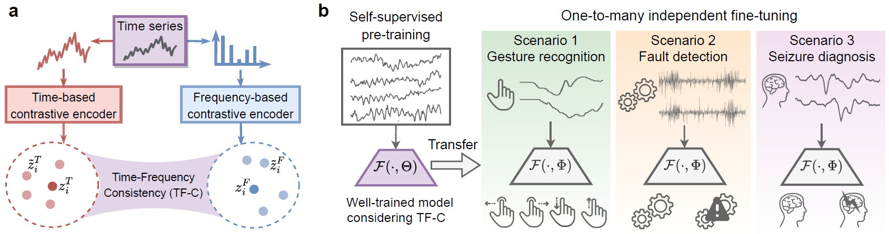

# Self-Supervised Contrastive Pre-Training For Time Series via Time-Frequency Consistency

#### Authors: [Xiang Zhang](http://xiangzhang.info/) (xiang.alan.zhang@gmail.com), [Ziyuan Zhao](https://github.com/mims-harvard/Raindrop)(ziyuanzhao@college.harvard.edu), <br/>
####  [Theodoros Tsiligkaridis](https://github.com/mims-harvard/Raindrop)(ttsili@ll.mit.edu), [Marinka Zitnik](https://zitniklab.hms.harvard.edu/) (marinka@hms.harvard.edu)

#### [Project website](https://zitniklab.hms.harvard.edu/projects/TF-C/)

#### TF-C Paper: [NeurIPS 2022](https://openreview.net/forum?id=OJ4mMfGKLN), [Preprint](https://arxiv.org/abs/2206.08496)

## Overview 

This repository contains eight processed datasets and the codes of developed TF-C pretraining model (along with baselines) for manuscript *Self-Supervised Contrastive Pre-Training For Time Series via Time-Frequency Consistency*. We propose TF-C, a novel pre-training approach for learning generalizable features that can be transferred across different time-series datasets. We evaluate TF-C on eight time series datasets with different sensor measurements and semantic meanings in four real-world application scenarios. The following illustration provides an overview of the idea behind and the broad applicability of our TF-C approach. The idea is shown in **(a)**: given a time series sample, time-based and frequency-based embeddings are made close to each other in a latent time-frequency space. The application scenarios are shown in **(b)**: leveraging TF-C in time series, we can generalize a pre-train models to diverse scenarios such as gesture recognition, fault detection, and seizure analysis.
<!-- Then we fine-tune the models to a small, problem-specific dataset for performing time series classification tasks. -->

<p align="center">
    
</p>


<!-- Please consult our paper for more details about our model and the experiments. -->


## Key idea of TF-C

Our model captures the generalizable property of time series, Time-Frequency Consistency (TF-C), in a large pre-training time series dataset. TF-C means the time-based representation and the frequency-based representation, which are learned from the same time series sample, are closer to each other in a joint time-frequency space, and farther apart if the representations are associated with different time series samples. By modeling the TF-C, which is a characteristic unique to time series, the developed model can capture the underlying common pattern in time series and further empower knowledge transfer across different time series datasets. The different time series datasets are compounded by complexity in terms of large variations of temporal dynamics across datasets, varying semantic meaning, irregular sampling, system factors (e.g., different devices or subjects), etc. 
Moreover, the developed model enables self-supervised pre-training (which doesn't demand labels in the pre-training dataset) by adopting contrastive learning framework. Our TF-C approach is shown in the following figure. 


<!-- See the following figure for an illustration of our TF-C approach. Please see our paper for details on the particular choices of encoder and projector networks, model hyperparameters, and component loss function. -->


<!-- Specifically, we adopt contrastive learning in time space to generate a time-based
67 representation.
Our model is inspired by the well-known Fourier theorem used extensively in signal processing that states the equivalence between time domain and frequency domain representations of a continuous-time signal. We not only devised augmentations for time series in the time domain and in the frequency domain, but our contrastive loss has an additional term that requires the time- and frequency-domain embeddings be close to each other. Inspired by the triplet loss, we further specify that the similarity between the original time-frequency embedding pairs to be smaller than other possible pairs. We believe our model structure combined with the contrastive loss is sufficiently general to introduce inductive bias to the model that drives transfer learning across different time series domains.  -->

<p align="center">
    
</p>

**Overview of TF-C approach.** our model has four components: a time encoder, a frequency encoder, and two cross-space projectors that map time-based and frequency-based representations, respectively, to the same time-frequency space. Together, the four components provide a way to embed the input time series to the latent time-frequency space such that time-based embedding and frequency-based embedding are close together. 
The TF-C property is realized by promoting the alignment of time- and frequency-based representations in the latent time-frequency space, providing a vehicle for transferring the well-trained model to a target dataset not seen before.


## Datasets

We prepared eight datasets for the four different scenarios that we used to compare our method against the baselines. The scenarios contain electrodiagnostic testing, human daily activity recognition, mechanical fault detection, and physical status monitoring. 

### Raw data

(1). **SleepEEG** contains 153 whole-night sleeping Electroencephalography (EEG) recordings that are monitored by sleep cassette. The data is collected from 82 healthy subjects. The 1-lead EEG signal is sampled at 100 Hz. We segment the EEG signals into segments (window size is 200) without overlapping and each segment forms a sample. Every sample is associated with one of the five sleeping patterns/stages: Wake (W), Non-rapid eye movement (N1, N2, N3) and Rapid Eye Movement (REM). After segmentation, we have 371,055 EEG samples. The [raw dataset](https://www.physionet.org/content/sleep-edfx/1.0.0/) is distributed under the Open Data Commons Attribution License v1.0.

(2). **Epilepsy** contains single-channel EEG measurements from 500 subjects. For each subject, the brain activity was recorded for 23.6 seconds. The dataset was then divided and shuffled (to mitigate sample-subject association) into 11,500 samples of 1 second each, sampled at 178 Hz. The raw dataset features 5 different classification labels corresponding to different status of the subject or location of measurement - eyes open, eyes closed, EEG measured in healthy brain region, EEG measured where the tumor was located, and, finally, the subject experiencing seizure episode. To emphasize the distinction between positive and negative samples in terms of epilepsy, We merge the first 4 classes into one and each time series sample has a binary label describing if the associated subject is experiencing seizure or not. There are 11,500 EEG samples in total. To evaluate the performance of pre-trained model on small fine-tuning dataset, we choose a tiny set (60 samples; 30 samples for each class) for fine-tuning and assess the model with a validation set (20 samples; 10 sample for each class). The model with best validation performance is use to make prediction on test set (the remaining 11,420 samples). The [raw dataset](https://repositori.upf.edu/handle/10230/42894) is distributed under the Creative Commons License (CC-BY) 4.0.

(3), (4). **FD-A** and **FD-B** are subsets taken from the **FD** dataset, which is gathered from an electromechanical drive system that monitors the condition of rolling bearings and detects damages in them. There are four subsets of data collected under various conditions, whose parameters include rotational speed, load torque, and radial force. Each rolling bearing can be undamaged, inner damaged, and outer damaged, which leads to three classes in total. We denote the subsets corresponding to condition A and condition B as Faulty Detection Condition A (**FD-A**) and Faulty Detection Condition B (**FD-B**) , respectively. Each original recording has a single channel with sampling frequency of 64k Hz and lasts 4 seconds. To deal with the long duration, we follow the procedure described by Eldele et al., that is, we use sliding window length of 5,120 observations and a shifting length of either 1,024 or 4,096 to make the final number of samples relatively balanced between classes. The [raw dataset](https://mb.uni-paderborn.de/en/kat/main-research/datacenter/bearing-datacenter/data-sets-and-download) is distributed under the Creative Commons Attribution-Non Commercial 4.0 International License.

(5). **HAR** contains recordings of 30 health volunteers performing six daily activities such as walking, walking upstairs, walking downstairs, sitting, standing, and laying. The prediction labels are the six activities. The wearable sensors on a smartphone measure triaxial linear acceleration and triaxial angular velocity at 50 Hz. After preprocessing and isolating out gravitational acceleration from body acceleration, there are nine channels in total. To line up the semantic domain with the channels in the dataset use during fine-tuning **Gesture** we only use the three channels of body linear accelerations. The [raw dataset](https://archive.ics.uci.edu/ml/datasets/Human+Activity+Recognition+Using+Smartphones) is distributed AS-IS and no responsibility implied or explicit can be addressed to the authors or their institutions for its use or misuse. Any commercial use is prohibited.

(6). **Gesture** contains accelerometer measurements of eight simple gestures that differed based on the paths of hand movement. The eight gestures are: hand swiping left, right, up, down, hand waving in a counterclockwise circle, or in clockwise circle, hand waving in a square, and waving a right arrow. The classification labels are those eight different types of gestures. The original paper reports inclusion of 4,480 gesture measurements, but through UCR Database we were only able to recover 440 measurements. The dataset is balanced with 55 samples each class and is of a suitable size for our purpose of fine-tuning experiments. Sampling frequency is not explicitly reported in the original paper but is presumably 100 Hz. The dataset uses three channels corresponding to three coordinate directions of linear acceleration. The [raw dataset](http://www.timeseriesclassification.com/description.php?Dataset=UWaveGestureLibrary) is publicly available.

(7). **ECG** is taken as a subset from the 2017 PhysioNet Challenge that focuses on ECG recording classification. The single lead ECG measures four different underlying conditions of cardiac arrhythmias. More specifically, these classes correspond to the recordings of normal sinus rhythm, atrial fibrillation (AF), alternative rhythm, or others (too noisy to be classified). The recordings are sampled at 300 Hz. Furthermore, the dataset is imbalanced, with much fewer samples from the atrial fibrillation and noisy classes out of all four. To preprocess the dataset, we use the code from the CLOCS paper, which applied fixed-length window of 1,500 observations to divide up the long recordings into short samples of 5 seconds in duration that is still physiologically meaningful. The [raw dataset](https://physionet.org/content/challenge-2017/1.0.0/) is distributed under the Open Data Commons Attribution License v1.0.

(8). Electromyograms (EMG) measures muscle responses as electrical activity to neural stimulation, and they can be used to diagnose certain muscular dystrophies and neuropathies. **EMG** consists of single-channel EMG recording from the tibialis anterior muscle of three volunteers that are healthy, suffering from neuropathy, and suffering from myopathy, respectively. The recordings are sampled with the frequency of 4K Hz. Each patient, i.e., their disorder, is a separate classification category. Then the recordings are split into time series samples using a fixed-length window of 1,500 observations. The [raw dataset](https://physionet.org/content/emgdb/1.0.0/) is distributed under the Open Data Commons Attribution License v1.0.

The following table summarizes the statistics of all these eight datasets:

| Scenario # |              | Dataset      | # Samples    | # Channels | # Classes | Length | Freq (Hz) |
| ---------- | ------------ | ------------ | ------------ | ---------- | --------- | ------ | --------- |
| 1          | Pre-training | **SleepEEG** | 371,055      | 1          | 5         | 200    | 100       |
|            | Fine-tuning  | **Epilepsy** | 60/20/11,420 | 1          | 2         | 178    | 174       |
| 2          | Pre-training | **FD-A**     | 8,184        | 1          | 3         | 5,120  | 64K       |
|            | Fine-tuning  | **FD-B**     | 60/21/13,559 | 1          | 3         | 5,120  | 64K       |
| 3          | Pre-training | **HAR**      | 10,299       | 9          | 6         | 128    | 50        |
|            | Fine-tuning  | **Gesture**  | 320/120/120  | 3          | 8         | 315    | 100       |
| 4          | Pre-training | **ECG**      | 43,673       | 1          | 4         | 1,500  | 300       |
|            | Fine-tuning  | **EMG**      | 122/41/41    | 1          | 3         | 1,500  | 4,000     |

### Processed data

We explain the data preprocessing and highlight some steps here for clarity. More details can be found in our paper appendix. In summary, our data-processing consists of two stages. First, we segmented time series recordings if they are too long. For fine-tuning (target) datasets, we split the dataset into train, validation, and test portions. We took care to assign all samples belonging to a single recording to one partition only whenever that is possible, to avoid leaking data from the test set into the training set, but for pre-processed datasets like Epilepsy this is not possible. The train: val ratio is at about 3: 1 and we used balanced number of samples for each class whenever possible. All remaining samples not included in the train and validation partitions are used in the test partition to better estimate the performance metrics of the models. After the first stage, we produced three *.pt* (pytorch format) files corresponding to the three partitions for each dataset. Each file contains a dictionary with keys of `samples` and `labels` and corresponding values of torch tensors storing the data, respectively. For samples, the tensor dimensions correspond to the number of samples, number of channels, and, finally, the length of each time series sample. This is the standard format that can be directly read by the TS-TCC model as well as our TF-C implementation. 
<!-- These preprocessed datasets can be conveniently downloaded from (????) or viaa script (???) into the datasets folder in this repo.  -->

The second step consists of converting, for each dataset, from the three .pt files, to the accepted input format for each of the baseline models and placing them in the correct directories relative to the script that handles the pre-training and fine-tuning process. We have prepared simple scripts for these straightforward tasks but did not automate them. To further reduce the clutter of files in the repo, we have chosen to omit them from the baseline folders. Also, note that in the second experiment of one-to-many pre-training, the fine-tuning datasets are further clipped to have the same length as the sleepEEG dataset. 
<!-- The pre-processing scripts are available upon reasonable request. -->

**Step one** 
The processed datasets can be manually downloaded at the following links. 

- wget -O SleepEEG.zip https://figshare.com/ndownloader/articles/19930178/versions/1
- wget -O Epilepsy.zip https://figshare.com/ndownloader/articles/19930199/versions/2 
- wget -O FD-A.zip https://figshare.com/ndownloader/articles/19930205/versions/1
- wget -O FD-B.zip https://figshare.com/ndownloader/articles/19930226/versions/1
- wget -O HAR.zip https://figshare.com/ndownloader/articles/19930244/versions/1
- wget -O Gesture.zip https://figshare.com/ndownloader/articles/19930247/versions/1
- wget -O ECG.zip https://figshare.com/ndownloader/articles/19930253/versions/1
- wget -O EMG.zip https://figshare.com/ndownloader/articles/19930250/versions/1

Then you have to place the files inside the corresponding folder under `data/dataset_name` (such as `data/SleepEEG`):

**The well-processed datasets will be released (in FigShare) after acceptance. **


Alternatively, you can use the `download_datasets.sh` script to automatically download and decompress all datasets into the respective directories. This immediately finishes the first step of preprocessing.

**Step two**
Now we explain in detail the second step. To begin with, TS-TCC and TS-SD (along with our TF-C model), as implemented under the TS-TCC codebase, can directly take in the datasets downloaded from the previous step. All that remains is to create the corresponding subdirectories at `TS-TCC/data/dataset_name` and put in the datasets inside. This is handled by the shell script `data_processing/TS-TCC.sh` which creates the folders and soft links that alias to the downloaded files.

For TS2Vec, it uses exactly the same kind of `{train,test}_{input,output}.npy` files as Mixing-up, so we will just process our downloaded datasets once and use them for these two models. The only difference in data format is the tensors for labels are two dimensional, so we have to insert an axis to each such tensor. This is handled in `data_processing/Mixing-up.py` and we can then run `data_processing/TS2vec.sh` to create aliases to the processed files.

Next, for CLOCS, we need to make a more complicated nested dictionary holding the time series and labels. Also, a time series sample is stored as a two dimensional tensor now, by eliminating the channel dimension, because CLOCS assumes that we discard channel information during data preprocessing. Again, the final datasets should be placed in the correct location, which is also in the format of `CLOCS/data/dataset_name`. However, due to aliasing issues, the name to be used may not align with how we named the datasets in the paper. Please use the python script `data_processing/CLOCS.py` to do the above steps automatically.

Finally, for SimCLR, we do not have a datafolder but directly place files under `SimCLR/dataset_name`. For the data itself, we note that the tensor storing time series have the second and third dimension, corresponding to channels and observations, swapped, relative to our starting files. Also, the labels cannot be numeric but have to be in one-hot format. These are handled in the `data_processing/SimCLR.py` script for convenience.

Of course, we also provide the shortcut script for doing all the steps above, by directly running `process_all.sh` from the root directory of the git repository. Make sure you are in the correct environment as specified by the `baseline_requirements.yml` before running the scripts.


## Experimental setups

We evaluated our model in two different settings and in comparison with eight baselines. The baselines include six state-of-the-art models that can be used for transfer learning in time series and two non-pre-training models ( a non-DL method (KNN in this case) and a randomly initialized model). The two different settings are:

**Setting 1: One-to-one pre-training.** We pre-trained a model on *one* pre-training dataset and use it for fine-tuning on *one* target dataset only. We tested the proposed model in four independent scenarios: neurological stage detection, mechanical device diagnosis, activity recognition, and physical status monitoring.  For example, in Scenario 1 (neurological stage detection), pre-training is done on SleepEEG and fine-tuning on Epilepsy. While both datasets describe a single-channel EEG, the signals are from different channels/positions on the scalp, monitor different physiology (sleep vs. epilepsy), and are collected from different patients. This setting simulates a wide range of practical scenarios where transfer learning may be useful in practice, when there's a domain gap and the fine-tuning dataset is small.

**Setting 2: One-to-many pre-training.** We pre-trained a model using *one* dataset followed by fine-tuning on *multiple* target datasets independently without pre-training from scratch. We chose SleepEEG for pre-training because of the large dataset size and complex temporal dynamics. We fine-tune on Epilepsy, FD-B, and EMG from the other three scenarios. The domain gaps are larger between the pre-training dataset and the three fine-tuning datasets this time, so this setting tests the generality of our model for transfer learning. 

<!-- **Setting 3: Ablation study.** To evaluate the relative importance of the different components of our model during pre-training, we modified or simplified the loss function and repeated the experiment. We also compared the performance difference between partial and full fine-tuning. For more details about our ablation study, please consult Appendix Table 7 in our paper. -->


## Requirements

TF-C has been tested using Python >=3.5.

For the baselines, we have not managed to unify the environments due to the large divergence in original baseline implementations. So you need to build three different environments to cover all six DL baselines. For ts2vec, use ts2vec_requirements.yml. For SimCLR, because Tang et al. used TensorFlow framework, please use simclr_requirements.yml. For the other four baselines, use `baseline_requirements.yml`. To use these files to install dependencies for this project via Conda, run the following command:

`conda env create -f XXX_requirements.yml `

## Running the code

**Reproduce our TF-C** Please download the processed datasets to folder `code/data/SleepEEG`. Make sure the folder name is the same with the dataset name. There are three key parameters: *training_mode* has two options *pre_train* and *fine_tune_test*; *pretrain_dataset* has four options *SleepEEG*, *FD_A*, *HAR*, and *ECG*; *target_dataset* has four options *Epilepsy*, *FD_B*, *Gesture*, and *EMG*. The hyper-parameters of the models can be found in the configure file in folder `config_files`. For example, when pre-train a model on SleepEEG and fine-tune it on Epilepsy, please run: 

`python main.py --training_mode pre_train --pretrain_dataset SleepEEG --target_dataset Epilepsy`

`python main.py --training_mode fine_tune_test --pretrain_dataset SleepEEG --target_dataset Epilepsy`

**Reproduce baselines** You are advised to run the models from the corresponding folders under `code/baselines/` using the command-line patterns described by the original authors' `README  .md` files whenever possible. We note that in the case of Mixing-up and SimCLR, pre-training and fine-tuning are done by directly running `train_model.py` and `finetune_model.py` without passing in arguments. Similarly, for CLOCS, one must manually modify the hyperparameters to the training procedure inside the main file (  `run_experiments.py` in this case). Please reach out to the original authors of these baselines if you have any questions about setting these hyperparameters in their models. Finally, for each baseline, on different pairs of datasets, the performance of transfer learning can vary depending on the hyperparameter choices. We have manually experimented with them and chose the combinations that gave the best performance while keeping the model complexity of different baselines comparable. We include tables describing the specific combinations of hyperparameters we used for different datasets whenever necessary, in the corresponding folder for the different baselines so that reproducing our result is made possible. Please note some baselines are designed for representation learning (instead of pre-training) of time series, we use these baselines in the same setups as our model to make results comparable.

## Citation

If you find *TF-C* useful for your research, please consider citing this paper:

````
```
@inproceedings{zhang2022self,
title = {Self-Supervised Contrastive Pre-Training For Time Series via Time-Frequency Consistency},
author = {Zhang, Xiang and Zhao, Ziyuan and Tsiligkaridis, Theodoros and Zitnik, Marinka},
booktitle = {Proceedings of Neural Information Processing Systems, NeurIPS},
year      = {2022}
}
```
````

## Updated Jan. 2023

We updated the implementation the proposed TF-C model on the following aspects.

1. Fixed bugs, cleaned the codes, and added comments for better understanding. The newly uploaded TF-C code is at path `TFC-pretraining/code/TFC`. All the necessary files to run it are provided in the folder. 
2. For the contrastive encoders (in both time and frequency domains), we replaced the 3 layers of CNN blocks with 2 layers of Transformer. We noticed that the performance is not improved (even with a slight decrease) but the stability is getting better. 
3. For the downstream classifier, we added a KNN classifier in parallel with the original MLP (2-layer) classifier. In preliminary experiments, we noticed that the performance of MLP varies across different setups and hyper-parameter settings. Thus, in this version, we provide two classifiers: 2-layer MLP and KNN (K=5). However, the reasons hidden behind the performance variance are still unknown, which needs further studies. 
4. For better reproduction, we hereby provided an example of a pre-trained model. The model weights can be found in path `TFC-pretraining/code/experiments_logs/SleepEEG_2_Epilepsy/run1/pre_train_seed_42_2layertransformer/saved_models/ckp_last.pt`. The model path is identical to the one used in code, so you may clone/download this whole repo and directly run the 'TFC-pretraining/code/TFC/main.py' file. 
    - This model is pretrained on the scenario: SleepEEG to Epilepsy (in this update, all the debugs are based on this setup). In specific, setting the training_mode as `pre_train` and pretrain_dataset as `SleepEEG`. In SleepEEG_Configs.py, all the hyper-parameters are unchanged, in specific, lr=0.0005, epoch number as 200 (200 for pretraining while 20 for finetuning). We set the random seed as 42.
    - In finetuning on Epilepsy (lr= 0.0005, epoch=20, batchsize=60), the finetuning set is still 60 samples (30 positive + 30 negative). There are 20 validation and 11420 test samples. But we have resplit the Epilepsy dataset (i.e., regenerated the 60 finetuning set) to test the stability of the model. The code for re-splitting is available at `TFC-pretraining/code/TFC/Data_split.py` and the split dataset is uploaded to this repo `TFC-pretraining/datasets/Epilepsy/` (it is also synchronized to Figshare). 
    - In such a seting, with the help of TFC, the best test performance on finetuning set is ~0.88 on F1 (achieved by MLP which beats KNN) while only ~0.60 without TFC pretraining. *Please note, for quick debugging, the model is pretrained on a subset of SleepEEG (1280 samples which are only <1% of the whole dataset).* Thus, we believe there's a large space to further boost the performance with more pretraining samples.
5. We'd like to share more ideas that may improve the TF-C framework in follow-up works. 
    - The 2-layer transformer could be modified based on the specific task (e.g., adding more layers for complex time series). The polishing on the backbone can be helpful. BTW, I didn't tune the hyper-parameters after switching to Transformer, a better hyperparameter setting (e.g., the number of layers, the dimension of Transformer, the dimension of the MLP hidden layer, etc.) might be helpful. 
    - Use different architectures in time-based and frequency-based encoders. As the signals' properties in the frequency domain is very different with time domain, a dedicated encoder architecture can be adopted to better capture the information.
    - Explore more augmentations in frequency domain. Now, we used adding or removing frequency components,  so that designing more perturbations (like bandpass filtering) is a promising way. 
    - In the frequency domain, we only leveraged the magnitude information, however, the phase is also very important. So, an important future topic will fully exploit the information in the frequency domain. 
    - Better projection. Now, we project the time- and frequency-based embeddings to a shared time-frequency domain. The current projectors' structure is a 2-layer MLP which is kind of simple. More powerful and helpful projecting methods are welcomed. 
    - More ideas may be added.


## Miscellaneous

Please send any questions you might have about the code and/or the algorithm to <xiang.alan.zhang@gmail.com>. 


## License

TF-C codebase is released under the MIT license.

