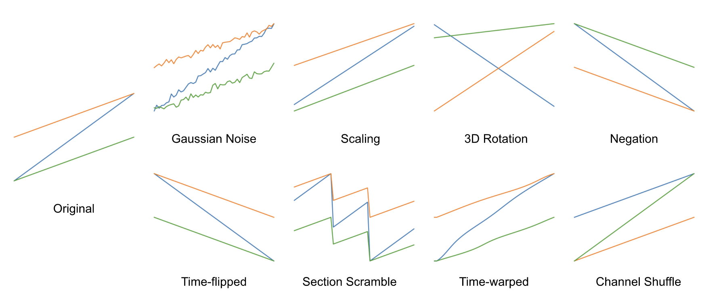
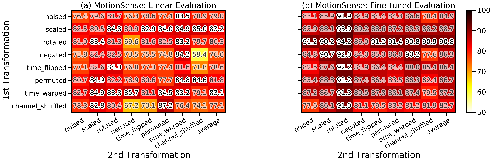

# Contrastive Learning for Human Activity Recognition


Motivated by the limitations of labeled datasets in HAR, particularly when employed in healthcare-related applications, this work explores the adoption and adaptation of SimCLR, a contrastive learning technique for visual representations, to HAR. We have found significant differences in performance when  different transformations were applied to sensor signals, and a slight improvement upon previous state-of-the-art self-supervised learning method was shown using contrastive learning.

More details can be found in our full paper: https://arxiv.org/abs/2011.11542.

A poster for this study can be found [here](https://iantangc.github.io/files/ML4MH_NeurIPS_2020_Tang_Poster.pdf).

This repository complements our paper, providing a reference implementation of the method as described in the paper. Please contact the authors for enquiries regarding the code.

# Citation

If you find our paper useful or use the code available in this repository in your research, please consider citing our work:

```
@article{tang2020exploring,
  title={Exploring Contrastive Learning in Human Activity Recognition for Healthcare},
  author={Tang, Chi Ian and Perez-Pozuelo, Ignacio and Spathis, Dimitris and Mascolo, Cecilia},
  journal={arXiv preprint arXiv:2011.11542},
  year={2020}
}
```

# Requirements
The code uses several external Python libraries for data analysis, machine learning and generating plots, listed as follows:

- scipy
- numpy
- sklearn
- pandas
- tensorflow
- matplotlib
- seaborn

Other Python standard libraries are also used.

# Running the Code

A demo implementation is provided in [`SimCLR_MotionSense.ipynb`](https://github.com/iantangc/ContrastiveLearning/blob/main/SimCLR_MotionSense.ipynb). In the demo, a HAR model is trained and evaluated on the MotionSense dataset following the settings outlined in our paper.

[](https://colab.research.google.com/github/iantangc/ContrastiveLearning/blob/main/SimCLR_MotionSense.ipynb)


# Results
In our evaluation, we used eight different transformations designed for sensor time-series.



We observed that the SimCLR framework displays promising results, slightly outperforming other fully-supervised and semi-supervised methods, which is indicative of the potential of transferring SimCLR to mobile sensing settings and other health data, especially due to the modality-agnostic nature of the method.  We also observed that the use of different transformation functions can affect the performance of the models, and in some cases, to a significant degree. 



# Code Organisation

Every Python script comes with full comments, detailing what the functions do. A brief description of each file is provided below:

- `SimCLR_MotionSense.ipynb`: The demo file which trains a HAR model using the MotionSense dataset following the settings outlined in our paper.
- `data_pre_processing.py`: This file contains various functions for pre-processing data and preparing it for training and evaluation.
- `raw_data_processing.py`: This file contains functionalities for parsing datasets from the original source into a Python object for easy working.
- `simclr_models.py`: This file contains the specifications of different models used for SimCLR training for HAR.
- `transformations.py`: THis file contains different functions for generating alternative views of sensor signals.

# License
The current version of this repository is released under the GNU General Public License v3.0 unless otherwise stated. The author of the repository retains their respective rights. The published paper is governed by a separate license and the authors retain their respective rights.

# Disclaimers
Disclaimer of Warranty.
THERE IS NO WARRANTY FOR THE PROGRAM, TO THE EXTENT PERMITTED BY APPLICABLE LAW. EXCEPT WHEN OTHERWISE STATED IN WRITING THE COPYRIGHT HOLDERS AND/OR OTHER PARTIES PROVIDE THE PROGRAM "AS IS" WITHOUT WARRANTY OF ANY KIND, EITHER EXPRESSED OR IMPLIED, INCLUDING, BUT NOT LIMITED TO, THE IMPLIED WARRANTIES OF MERCHANTABILITY AND FITNESS FOR A PARTICULAR PURPOSE. THE ENTIRE RISK AS TO THE QUALITY AND PERFORMANCE OF THE PROGRAM IS WITH YOU. SHOULD THE PROGRAM PROVE DEFECTIVE, YOU ASSUME THE COST OF ALL NECESSARY SERVICING, REPAIR OR CORRECTION.

Limitation of Liability.
IN NO EVENT UNLESS REQUIRED BY APPLICABLE LAW OR AGREED TO IN WRITING WILL ANY COPYRIGHT HOLDER, OR ANY OTHER PARTY WHO MODIFIES AND/OR CONVEYS THE PROGRAM AS PERMITTED ABOVE, BE LIABLE TO YOU FOR DAMAGES, INCLUDING ANY GENERAL, SPECIAL, INCIDENTAL OR CONSEQUENTIAL DAMAGES ARISING OUT OF THE USE OR INABILITY TO USE THE PROGRAM (INCLUDING BUT NOT LIMITED TO LOSS OF DATA OR DATA BEING RENDERED INACCURATE OR LOSSES SUSTAINED BY YOU OR THIRD PARTIES OR A FAILURE OF THE PROGRAM TO OPERATE WITH ANY OTHER PROGRAMS), EVEN IF SUCH HOLDER OR OTHER PARTY HAS BEEN ADVISED OF THE POSSIBILITY OF SUCH DAMAGES.

# Other works used in this project
This work made use of the MotionSense dataset available at https://github.com/mmalekzadeh/motion-sense.

The transformation functions for the time-series in this repository is based on Um et al.'s work at https://github.com/terryum/Data-Augmentation-For-Wearable-Sensor-Data.

The NT-Xent Loss function is based on a implemention by The SimCLR Authors, at https://github.com/google-research/simclr.

# Copyright

Copyright (c) 2020 Chi Ian Tang


# Hyperparameters

Range of random seeds used for the five replicates is 1 - 5.

We used 100 epochs uniformly for the fine-tuning steps in all scenarios.

The following table shows hyperparameters that vary between different scenarios that produced the best results we have obtained and reported in the paper:

|          | n_epochs for pre-training |
| -------- | ------------------------- |
| SleepEEG | 5                         |
| FD-A     | 20                        |
| HAR      | 40                        |
| ECG      | 5                         |

