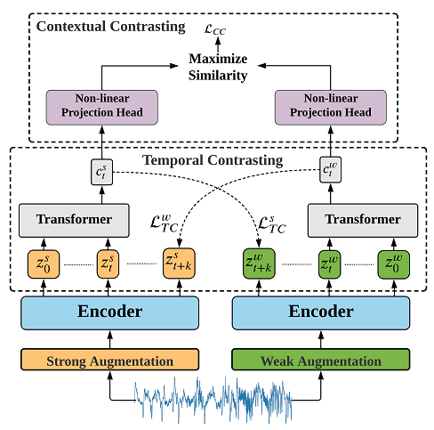

# Time-Series Representation Learning via Temporal and Contextual Contrasting (TS-TCC) [[Paper](https://www.ijcai.org/proceedings/2021/0324.pdf)]
#### *by: Emadeldeen Eldele, Mohamed Ragab, Zhenghua Chen, Min Wu, Chee Keong Kwoh, Xiaoli Li and Cuntai Guan*
#### This work is accepted for publication in the International Joint Conferences on Artificial Intelligence (IJCAI-21) (Acceptance Rate: 13.9%).

## Abstract

Learning decent representations from unlabeled time-series data with temporal dynamics is a very challenging task. 
In this paper, we propose an unsupervised <b>T</b>ime-<b>S</b>eries representation learning framework via <b>T</b>emporal and <b>C</b>ontextual <b>C</b>ontrasting 
(<b>TS-TCC</b>), to learn time-series representation from unlabeled data. 
First, the raw time-series data are transformed into two different yet correlated views by using weak and strong augmentations. 
Second, we propose a novel temporal contrasting module to learn <i>robust</i> temporal representations by designing a tough cross-view prediction task. 
Last, to further learn <i>discriminative</i> representations, we propose a contextual contrasting module built upon the 
contexts from the temporal contrasting module. It attempts to maximize the similarity among different contexts of the same sample while minimizing 
similarity among contexts of different samples. Experiments have been carried out on three real-world time-series datasets. 
The results manifest that training a linear classifier on top of the features learned by our proposed TS-TCC performs 
comparably with the supervised training. Additionally, our proposed TS-TCC shows high efficiency in few-labeled data and transfer learning scenarios. 


## Requirmenets:
- Python3.x
- Pytorch==1.7
- Numpy
- Sklearn
- Pandas
- openpyxl (for classification reports)
- mne=='0.20.7' (For Sleep-EDF preprocessing)
- mat4py (for Fault diagnosis preprocessing)
## Datasets
### Download datasets
> `Update:` You can now find the preprocessed datasets [on this Dataverse](https://researchdata.ntu.edu.sg/dataverse/tstcc/)

We used four public datasets in this study:
- [Sleep-EDF](https://gist.github.com/emadeldeen24/a22691e36759934e53984289a94cb09b)
- [HAR](https://archive.ics.uci.edu/ml/datasets/Human+Activity+Recognition+Using+Smartphones)  
- [Epilepsy](https://archive.ics.uci.edu/ml/datasets/Epileptic+Seizure+Recognition) (this dataset is recently removed for some reason, so I uploaded the data file to the repo)
- [Fault Diagnosis](https://mb.uni-paderborn.de/en/kat/main-research/datacenter/bearing-datacenter/data-sets-and-download)

### Preparing datasets
The data should be in a separate folder called "data" inside the project folder.
Inside that folder, you should have a separate folders; one for each dataset. Each subfolder should have "train.pt", "val.pt" and "test.pt" files.
The structure of data files should in dictionary form as follows:
`train.pt = {"samples": data, "labels: labels}`, and similarly `val.pt`, and `test.pt`

The details of preprocessing is as follows:
#### 1- Sleep-EDF dataset:
Create a folder named `data_files` in the path `data_preprocessing/sleep-edf/`.
Download the dataset files and place them in this folder. 

Run the script `preprocess_sleep_edf.py` to generate the numpy files ... you will find the numpy files of 
each PSG file in another folder named `sleepEDF20_fpzcz` (you can change these names from args).
You will also find the data of each subject in the folder `sleepEDF20_fpzcz_subjects` (since each subject has two-night data)

Finally run the file `generate_train_val_test.py` to generate the files and it will automatically place
them in the `data/sleepEDF` folder.

#### 2- UCI HAR dataset
When you dowload the dataset and extract the zip file, you will find the data in a folder named
`UCI HAR Dataset` ... place it in `data_preprocessing/uci_har/` folder and run `preprocess_har.py` file.

#### 3- Epilepsy and Fault diagnosis datasets:
download the data file in `data_files` folder and run the preprocessing scripts.


### Configurations
The configuration files in the `config_files` folder should have the same name as the dataset folder name.
For example, for HAR dataset, the data folder name is `HAR` and the configuration file is `HAR_Configs.py`.
From these files, you can update the training parameters.

## Training TS-TCC 
You can select one of several training modes:
 - Random Initialization (random_init)
 - Supervised training (supervised)
 - Self-supervised training (self_supervised)
 - Fine-tuning the self-supervised model (fine_tune)
 - Training a linear classifier (train_linear)

The code allows also setting a name for the experiment, and a name of separate runs in each experiment.
It also allows the choice of a random seed value.

To use these options:
```
python main.py --experiment_description exp1 --run_description run_1 --seed 123 --training_mode random_init --selected_dataset HAR
```
Note that the name of the dataset should be the same name as inside the "data" folder, and the training modes should be
the same as the ones above.

To train the model for the `fine_tune` and `train_linear` modes, you have to run `self_supervised` first.


## Results
- The experiments are saved in "experiments_logs" directory by default (you can change that from args too).
- Each experiment will have a log file and a final classification report in case of modes other that "self-supervised".

## Citation
If you found this work useful for you, please consider citing it.
```
@inproceedings{ijcai2021-324,
  title     = {Time-Series Representation Learning via Temporal and Contextual Contrasting},
  author    = {Eldele, Emadeldeen and Ragab, Mohamed and Chen, Zhenghua and Wu, Min and Kwoh, Chee Keong and Li, Xiaoli and Guan, Cuntai},
  booktitle = {Proceedings of the Thirtieth International Joint Conference on Artificial Intelligence, {IJCAI-21}},
  pages     = {2352--2359},
  year      = {2021},
}
```

## Contact
For any issues/questions regarding the paper or reproducing the results, please contact me.   
Emadeldeen Eldele   
School of Computer Science and Engineering (SCSE),   
Nanyang Technological University (NTU), Singapore.   
Email: emad0002{at}e.ntu.edu.sg   


# Hyperparameters

Range of random seeds used for the five replicates is 2-5 and 123.

Learning rate is set to 3e-4 throughout all training steps. 

The following table shows hyperparameters that vary between different scenarios that produced the best results we have obtained and reported in the paper:

|          | n_epochs | batch_size |
| -------- | -------- | ---------- |
| SleepEEG | 40       | 128        |
| Epilepsy | 40       | 20         |
| FD-A     | 40       | 128        |
| FD-B     | 40       | 16         |
| HAR      | 40       | 128        |
| Gesture  | 40       | 16         |
| ECG      | 40       | 128        |
| EMG      | 20       | 16         |


Notably, the TS-TCC codebase is also used to implement TS-SD. The same collection of random seeds is used. Learning rate for pre-training is set to 3e-7 due to the smaller magnitude of the loss function used for the time series denoising task. The hyperparameters choices are reported below:

|          | n_epochs | batch_size |
| -------- | -------- | ---------- |
| SleepEEG | 3        | 128        |
| Epilepsy | 80       | 16         |
| FD-A     | 3        | 4          |
| FD-B     | 40       | 16         |
| HAR      | 5        | 64         |
| Gesture  | 40       | 16         |
| ECG      | 1        | 64         |
| EMG      | 20       | 16         |
